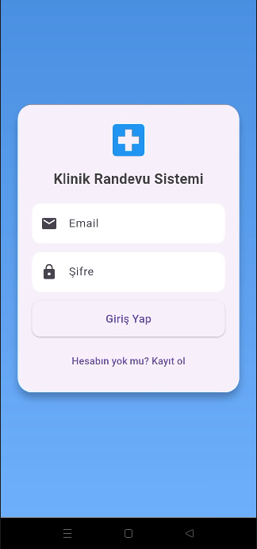
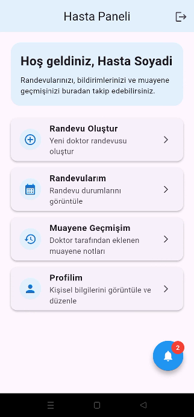
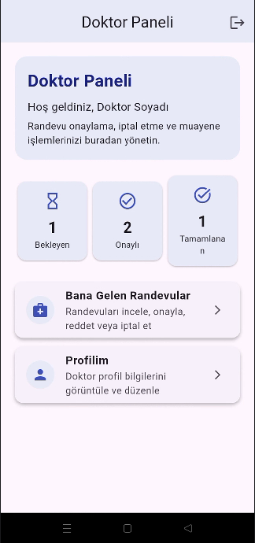

# 🏥 Klinik Randevu ve Muayene Kayıt Sistemi

Mobil Programlama dersi final projesi kapsamında geliştirilmiş modern klinik yönetim uygulamasıdır.

Bu uygulama sayesinde:
- Hastalar online randevu oluşturabilir,
- Doktorlar randevuları yönetebilir,
- Muayene notları tutulabilir,
- Bildirim sistemi ile kullanıcı bilgilendirmesi yapılabilir,
- Klinik süreçleri dijital olarak yönetilebilir.

---

# 🎓 Öğrenci Bilgileri

| Bilgi | Değer |
|---|---|
| Üniversite | Selçuk Üniversitesi |
| Fakülte | Teknoloji Fakültesi |
| Bölüm | Bilgisayar Mühendisliği |
| Ders | Mobil Programlama |
| Öğrenci No | 233301108 |
| Ad Soyad | Umutcan Batakbaşı |
| Sınıf | 4. Sınıf |

---

# 📱 Proje Özeti

Uygulama Flutter kullanılarak geliştirilmiştir.

Backend tarafında:
- Supabase Authentication
- Supabase PostgreSQL Database
- Row Level Security (RLS)

kullanılmıştır.

Sistem:
- Hasta
- Doktor

olmak üzere iki farklı kullanıcı rolü ile çalışmaktadır.

---

# 📸 Uygulama Görselleri
<p align="center">
  
  
  
</p>

---

# 🧩 Kullanılan Teknolojiler

## Frontend
- Flutter
- Dart
- Material Design

## Backend
- Supabase Auth
- Supabase Database
- PostgreSQL

## Mimari Yapı
- Screen-based architecture
- Service layer
- Core utility structure
- Widget-based UI design

---

# 📂 Proje Dosya Yapısı

```text
lib/
│
├── core/
│   ├── supabase_client.dart
│   └── utils.dart
│
├── services/
│   └── log_service.dart
│
├── screens/
│   ├── appointment_detail_page.dart
│   ├── auth_gate.dart
│   ├── create_appointment_page.dart
│   ├── dashboard_page.dart
│   ├── doctor_appointments_page.dart
│   ├── doctor_dashboard_page.dart
│   ├── doctor_upcoming_appointments_page.dart
│   ├── examination_form_page.dart
│   ├── home_page.dart
│   ├── notifications_page.dart
│   ├── patient_appointments_page.dart
│   ├── patient_dashboard_page.dart
│   ├── patient_examinations_page.dart
│   └── profile_page.dart
│
├── app.dart
└── main.dart
```

---

# 🔐 Kimlik Doğrulama Sistemi

Sistem Supabase Authentication kullanmaktadır.

Özellikler:
- Kullanıcı kayıt olma
- Kullanıcı giriş yapma
- Çıkış yapma
- Oturumun korunması
- Rol bazlı kullanıcı sistemi

---

# 👨‍⚕️ Doktor Özellikleri

## Randevu Yönetimi
- Gelen randevuları görüntüleme
- Randevu onaylama
- Randevu reddetme
- Randevu iptal etme
- Gelecek randevuları listeleme

## Muayene Sistemi
- Muayene notu ekleme
- Tanı ekleme
- Tedavi bilgisi ekleme
- Hasta geçmişini görüntüleme

## Bildirim Sistemi
- Tarih değişikliği bildirimi
- Yeni randevu bildirimi
- Durum güncelleme bildirimi

---

# 🧑‍💻 Hasta Özellikleri

## Randevu Sistemi
- Online randevu alma
- Mesai saatleri kontrolü
- Aynı saat çakışma kontrolü
- Randevu güncelleme
- 24 saat kuralı kontrolü

## Bildirim Sistemi
- Randevu onay bildirimi
- Randevu red bildirimi
- Muayene notu bildirimi
- Yeni bildirim göstergesi

## Muayene Geçmişi
- Geçmiş muayeneleri görüntüleme
- Doktor notlarını görüntüleme
- Tanı ve tedavi bilgilerini görüntüleme

---

# ⏰ Mesai Saati Kontrolü

Sistem yalnızca aşağıdaki zamanlarda randevu oluşturulmasına izin verir:

| Günler | Saat |
|---|---|
| Pazartesi - Cuma | 09:00 - 17:00 |

Hafta sonu randevu oluşturulamaz.

---

# 🔔 Bildirim Sistemi

Uygulama içerisinde gerçek zamanlı bildirim sistemi bulunmaktadır.

Özellikler:
- Okunmamış bildirim göstergesi
- Bildirim okundu kontrolü
- Sayfa yönlendirmeli bildirim sistemi
- Duruma göre bildirim üretimi

---

# 🗃️ Veritabanı Tabloları

Projede aşağıdaki tablolar kullanılmaktadır:

| Tablo | Açıklama |
|---|---|
| profiles | Kullanıcı bilgileri |
| appointments | Randevu kayıtları |
| notifications | Bildirim sistemi |
| examinations | Muayene kayıtları |
| logs | Sistem log kayıtları |

---

# 📋 Log Sistemi

Uygulama içerisinde yapılan işlemler kayıt altına alınmaktadır.

Örnek loglar:
- Giriş işlemleri
- Çıkış işlemleri
- Randevu oluşturma
- Randevu güncelleme
- Muayene notu ekleme

---

# 🧪 Test Hesapları

## Doktor Hesabı

| Bilgi | Değer |
|---|---|
| E-Posta | doktor_test@mail.com |
| Şifre | doktor123456 |

---

## Hasta Hesabı

| Bilgi | Değer |
|---|---|
| E-Posta | hasta_test@mail.com |
| Şifre | hasta123456 |

---

# ⚙️ Kurulum

## 1. Projeyi Klonlayın

```bash
git clone https://github.com/umutbatakbasi/233301108_UmutcanBatakbasi_Flutter_Proje
```

---

## 2. Proje Klasörüne Girin

```bash
cd klinik_app
```

---

## 3. Paketleri Kurun

```bash
flutter pub get
```

---

## 4. Uygulamayı Çalıştırın

```bash
flutter run
```

---

# 🚀 Öne Çıkan Özellikler

✅ Modern Flutter arayüzü  
✅ Supabase entegrasyonu  
✅ Rol bazlı kullanıcı sistemi  
✅ Klinik yönetim mantığı  
✅ Bildirim sistemi  
✅ Randevu yönetim sistemi  
✅ Muayene geçmişi sistemi  
✅ Responsive tasarım  
✅ Modüler proje mimarisi  
✅ Log sistemi  

---

# 📌 Gereksinim Karşılamaları

| Gereksinim | Durum |
|---|---|
| İki farklı kullanıcı rolü | ✅ |
| Supabase/Firebase kullanımı | ✅ |
| Auth sistemi | ✅ |
| Kalıcı oturum | ✅ |
| En az 5 ekran | ✅ |
| Log sistemi | ✅ |
| README test hesapları | ✅ |

---

# 👨‍💻 Geliştirici

**Umutcan Batakbaşı**  
Selçuk Üniversitesi - Bilgisayar Mühendisliği

---

# ⭐ Not

Bu proje eğitim amaçlı geliştirilmiştir.
